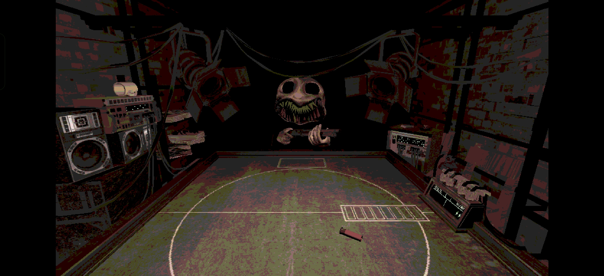

# Buckshot Roulette — Fan Remake (Android · iOS · iPadOS)

## Description

**Buckshot Roulette** game **reverse-engineered** from the original PC version and made compatible with **Android** and **iOS**, since a mobile version doesn't exist yet

## Requirements

| Platform | Minimum version | Notes |
|---|---|---|
| **Android** | Android **5.0** (Lollipop, API 21) or later | 64-bit ARM devices only (`arm64-v8a`) · targets Android 14 · APK ≈ 370 MB |
| **iOS / iPadOS** | iOS / iPadOS **18** or later | iPhone and iPad supported (arm64) · IPA ≈ 265 MB |

## Download & install

Get the latest `.apk` (Android) or `.ipa` (iOS / iPadOS) from the [**Releases page**](https://github.com/LBNM-ONE/Buckshot-Roulette---Andorid-iOS-also-iPadOS-/releases/latest).

### Android

1. Download the `.apk` from the Releases page.
2. When prompted, allow your browser / file manager to **install unknown apps** (Settings → Apps → Special access → Install unknown apps).
3. Open the downloaded file and install. That's it — the game is fully offline and requests **no permissions at all**.

### iOS / iPadOS

The game is **not on the App Store**, so the `.ipa` must be sideloaded and signed with your own Apple ID:

- **[AltStore](https://altstore.io/) / [SideStore](https://sidestore.io/) / [Sideloadly](https://sideloadly.io/)** — the usual sideloading route. With a free Apple ID the app must be re-signed every **7 days** (a paid developer account extends this to one year).
- **Xcode** — if you have a Mac, you can sign and install the IPA onto your own device with your Apple ID.

## Built with

- [Godot Engine](https://godotengine.org/) **4.3**
- Exported natively for Android (`arm64-v8a`) and iOS/iPadOS (arm64)

## License

Everything **created for this remake** is released into the public domain under the [Unlicense](LICENSE). *Buckshot Roulette* itself — the name, the original game and all of its assets — remains the property of Mike Klubnika / CRITICAL REFLEX; the name is used here purely to identify the subject of the remake.

## Credits

Mike Klubnika (https://store.steampowered.com/app/2835570/Buckshot_Roulette/)
